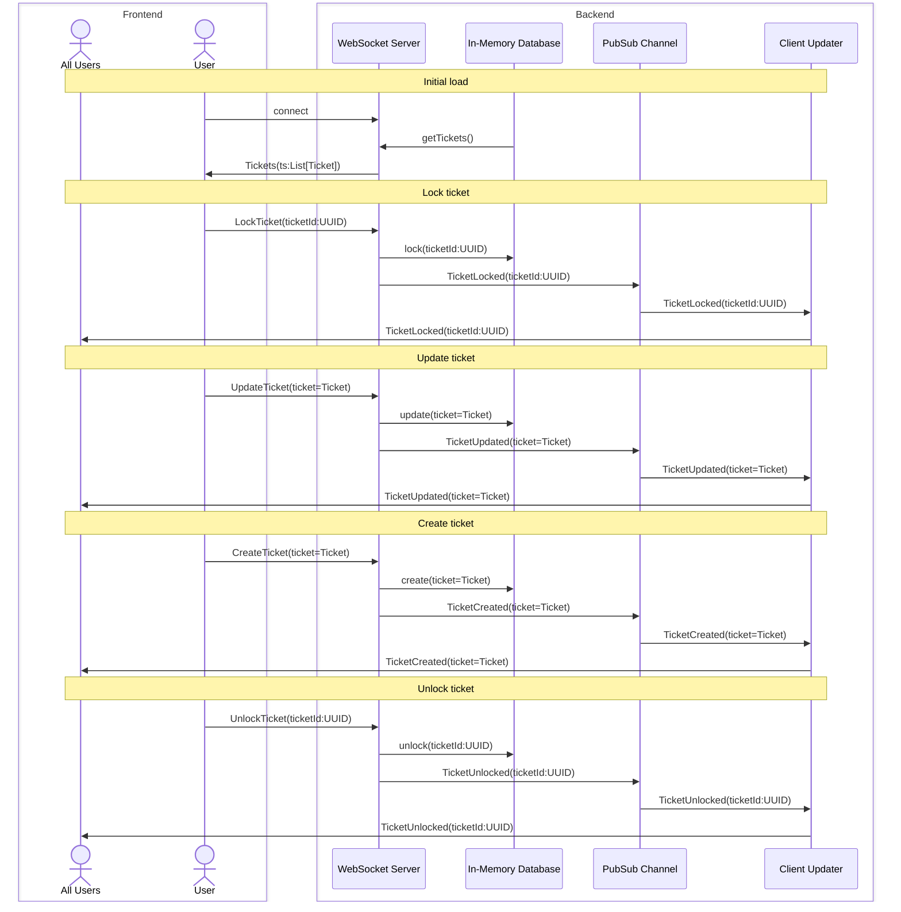

<pre style="text-align: center">
_                 ____  _ _ _      _       
| |               |  _ \(_) | |    | |      
| |     ___  ___  | |_) |_| | | ___| |_ __ ®
| |    / _ \/ __| |  _ <| | | |/ _ \ __/ __|
| |___|  __/\__ \ | |_) | | | |  __/ |_\__ \
|______\___||___/ |____/|_|_|_|\___|\__|___/
.-.. . ... -... .. .-.. .-.. . - ...
Support Ticketing System
</pre>

### Message Flow Diagram

