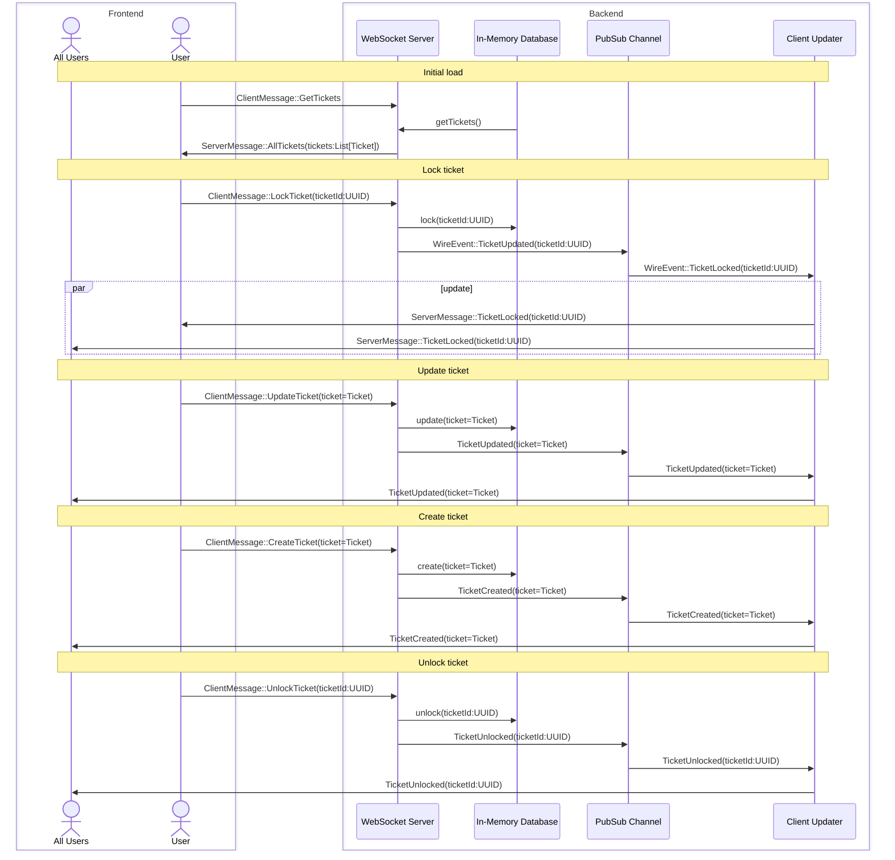

<pre style="text-align: center">
_                 ____  _ _ _      _       
| |               |  _ \(_) | |    | |      
| |     ___  ___  | |_) |_| | | ___| |_ __ ®
| |    / _ \/ __| |  _ <| | | |/ _ \ __/ __|
| |___|  __/\__ \ | |_) | | | |  __/ |_\__ \
|______\___||___/ |____/|_|_|_|\___|\__|___/

.-.. . ... -... .. .-.. .-.. . - ...

Support Ticketing System
</pre>

### Notes

* **Bun** is a great runtime. Just is.
* **Code comments** are not necessary (hopefully).
* **Drizzle migrations** are fragile: one day they work, on another day — no.
  > Something like `for f in *.sql; do cat $i | sqlite3 tickets.db; done` will
  work always.
* **Drizzle** has to go at some point. My distrust of ORMs once again proves
  itself to be warranted.
* **Unit tests** would be virtually useless. Types do the heavy lifting for you.
* **Integration tests** would be very nice to have.
* **TypeScript** happens to be a great language if you know how to use it.

### Message Flow Diagram

> This diagram is somewhat outdated but it should provide a good idea, what the
> system is supposed to do. > > To learn more on how it works, start with
> `package.json` in `packages/*` and work your way down.
>
> Open an issue, if something is unclear.

